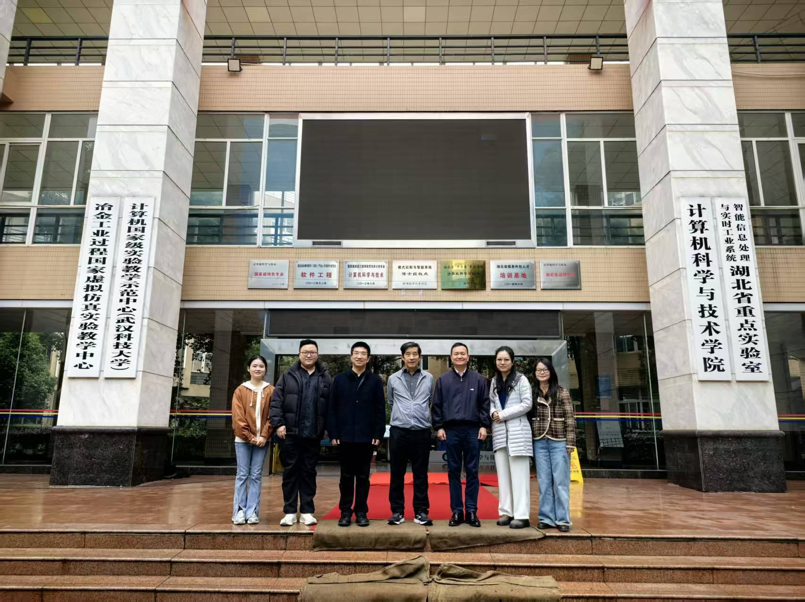
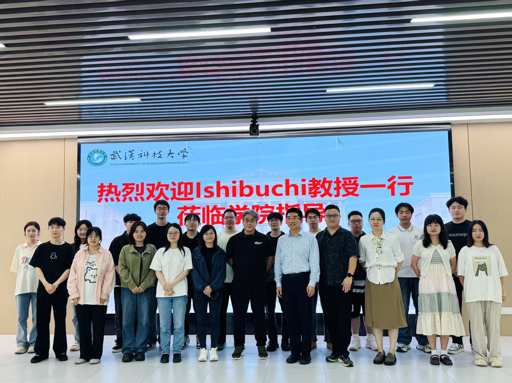
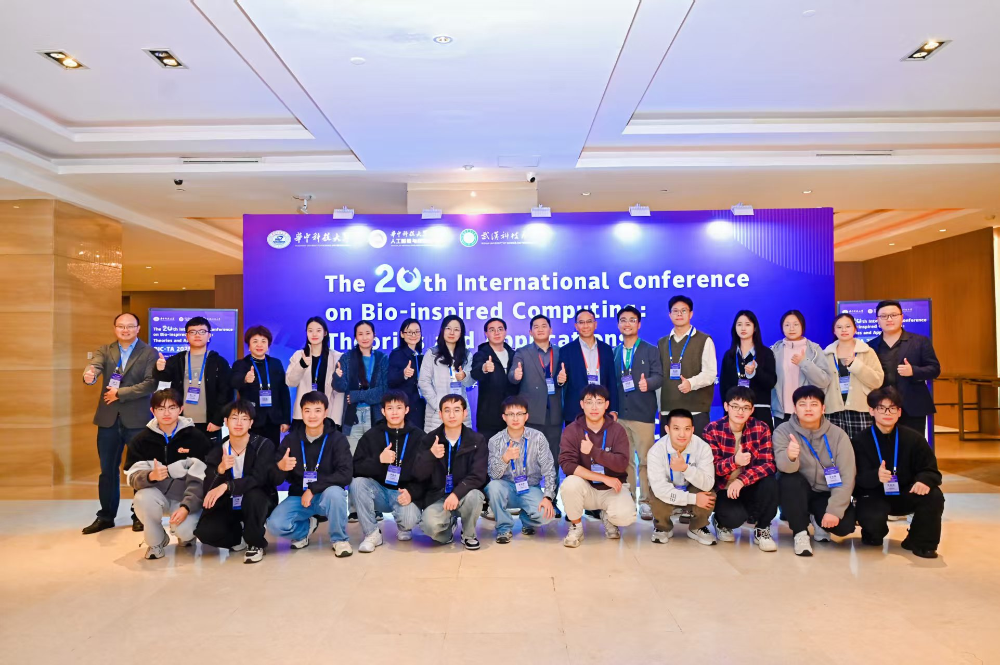
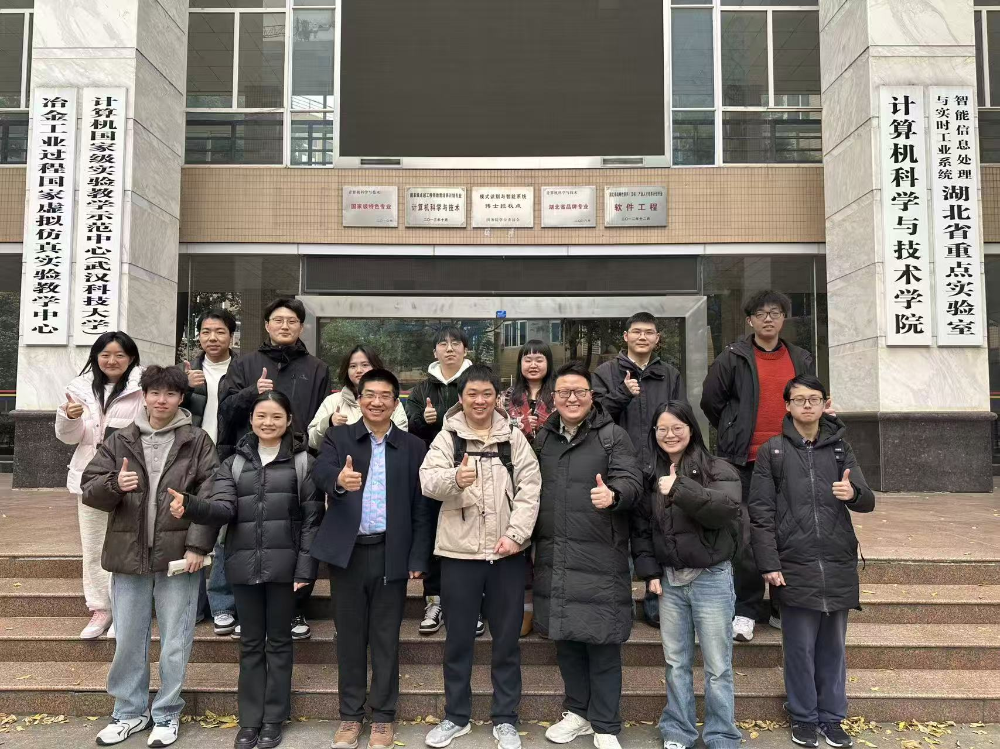
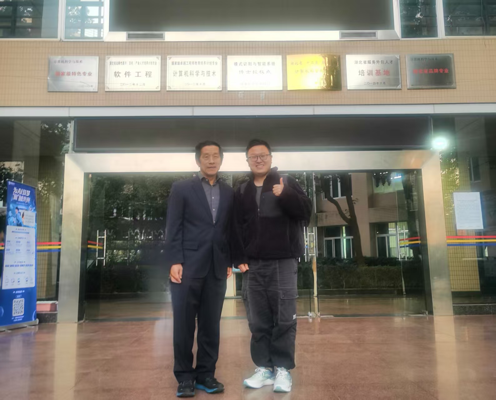

<!-- ================= Research Highlights Carousel Start ================= -->

  

    

      
 
        
        

          <h3>Warmly Welcome IEEE Fellow Professor Gary G. Yen to Visit Our Research Group in 2025</h3>
          

            It is a great honor for our research group to welcome Professor Gary G. Yen, IEEE Fellow,
            for academic exchange and scholarly discussion.
          

        

      

      
 
        
        

          <h3>Warmly Welcome IEEE Fellow Professor Hisao Ishibuchi to Visit Our Research Group in 2025</h3>
          

            It is a great honor for our research group to welcome Professor Hisao Ishibuchi, IEEE Fellow,
            for academic exchange and scholarly discussion.
          

        

      

      
 
        
        

          <h3>Our Research Group Co-organized BICTA 2025</h3>
          

            As a co-organizer of BICTA 2025, our research group actively supported scholarly
            exchange and interdisciplinary collaboration in bio-inspired computing,
            evolutionary computation, and intelligent optimization.
          

        

      

      
 
        
        

          <h3>Warmly Welcome Professor Ye Tian to Visit Our Research Group in 2025</h3>
          

            It is a great honor for our research group to welcome Professor Ye Tian
            for academic exchange and scholarly discussion.
          

        

      

      
 
        
        

          <h3>Warmly Welcome IEEE Fellow Professor Gary G. Yen to Visit Our Research Group in 2023</h3>
          

            It is a great honor for our research group to welcome Professor Gary G. Yen, IEEE Fellow,
            for academic exchange and scholarly discussion.
          

        

      

    

    <button class="research-carousel-btn prev" type="button" aria-label="Previous slide">&#10094;</button>
    <button class="research-carousel-btn next" type="button" aria-label="Next slide">&#10095;</button>
  

  

# BIO

I am now a lecturer at the School of Computer Science and Technology and the Hubei Provincial Key Laboratory of Intelligent Information Processing and Real-time Industrial Systems, Wuhan University of Science and Technology, Wuhan, China. I have received the B.S. degree in information security from the Wuhan University of Science and Technology, Wuhan, China, in 2017, and the Ph.D. degree in control science and engineering from Wuhan University of Science and Technology, Wuhan, China, in 2022. I was supervised by Professor `Kai Zhang`, who is the `Dean of the Graduate School of Wuhan University of Science and Technology`, the `Dean of the School of Computer Science and Technology at Wuhan University of Science and Technology`, the `Director of the Hubei Provincial Key Laboratory of Intelligent Information Processing and Real-time Industrial Systems` in China. From March to September 2025, I visited the School of Artificial Intelligence and Automation at Huazhong University of Science and Technology as a visiting scholar, under the guidance of Professor `Linqiang Pan`.

I am a member of the **Institute of Electrical and Electronics Engineers (IEEE)**, **China Computer Federation (CCF)**, **Association for Computing Machinery (ACM)**, **Chinese Association for Artificial Intelligence (CAAI)**, **Chinese Association of Automation (CAA)**, **Chinese Institute of Electronics (CIE)**, **IEEE Systems, Man, and Cybernetics Society (IEEE-SMC)**, **IEEE Computational Intelligence Society (IEEE-CIS)**, **Technical Committee on Intelligent Simulation Optimization and Scheduling, China Simulation Federation (CSF)** , and **ACM Special Interest Group on Genetic and Evolutionary Computation (ACM-SIGEVO)**. Recognized as a high-quality content creator and blogging expert in the field of artificial intelligence on CSDN, I have actively contributed to the academic community.

I was awarded the National Scholarship for Master's students in 2019 and the National Scholarship for Doctoral students in 2021 and 2022 by the Ministry of Education of China. Recently, I have achieved significant advancements and breakthroughs in multi-task multi-objective optimization, constrained multi-objective optimization, and many-objective optimization.

I have participated in two projects funded by the National Natural Science Foundation of China and led a youth project funded by the Provincial Natural Science Foundation. My research findings have been published in top-tier international journals such as **IEEE Transactions on Evolutionary Computation**, **IEEE Transactions on Cybernetics**, **IEEE Transactions on Intelligent Transportation Systems**, **Information Sciences**, **Science China: Information Sciences**, and **Applied Soft Computing**.

I was recognized as an Excellent Graduate Student at the Annual Meeting and Academic Seminar of the Wuhan Computer Software Engineering Society in both 2021 and 2022, and won the First Prize at the 2021 CCF Wuhan Excellent Doctoral Student Academic Showcase Forum. 

I serve as a reviewer for leading international journals including **IEEE Transactions on Evolutionary Computation**, **IEEE Transactions on Systems, Man, and Cybernetics: Systems**, **IEEE Transactions on Cybernetics**, **Information Sciences**, **Applied Soft Computing**, **Robotics and Computer-Integrated Manufacturing**, **Neural Computing and Applications**, **Engineering Applications of Artificial Intelligence**, **Expert Systems with Applications**, and **Journal of Membrane Computing**.

Additionally, I am a reviewer for international conferences such as the **IEEE Congress on Evolutionary Computation (IEEE CEC)**, **IEEE Symposium Series on Computational Intelligence (SSCI)**, **IEEE Conference on Artificial Intelligence (IEEE CAI)** and the **International Conference on Bio-inspired Computing: Theories and Applications (BIC-TA)**.

I have Served as a Session Chair at the **19th International Conference on Bio-inspired Computing: Theories and Applications (BIC-TA 2024)**, **20th International Conference on Bio-inspired Computing: Theories and Applications (BIC-TA 2025)**, Program Committee Member for the **2025 Asia Conference on Artificial Intelligence Technology (ACAIT2025)** and **The International Conference on Machine Intelligence and Nature-inspired Computing (MIND 2025)**.

My research interests include:

- Neural Combinatorial Optimization
- Scheduling and Vehicle Routing Planning
- Evolutionary Computation
- Multi-objective Optimization (Many-objective, Constrained, Multi-task, Multimodal, etc.)
- DNA Computing, Encoding, and Self-Assembly

## 📎 Homepages
- Personal Pages: https://JaywayXu.github.io (updated recently🔥)
- 中文站点：https://JaywayXu.github.io/zh-cn/ （`如果您是国内的学者，想要更多了解我们课题组的动态`）
- Google Scholar: https://scholar.google.com/citations?user=_Lkioz8AAAAJ&hl
- Researchgate: https://www.researchgate.net/profile/Zhiwei-Xu-16
- 微信公众号： 演化计算与人工智能

- CSDN: 武科大许志伟 : https://xuzhiwei.blog.csdn.net/
 
- Email: xuzhiwei@wust.edu.cn

## 💻 Selected Research Papers
My full paper list is shown at [my personal homepage](https://JaywayXu.github.io/) or [中文主站](https://JaywayXu.github.io/zh-cn/).

---

## 💻 Selected Research Papers
My full paper list is shown at [my personal homepage](https://JaywayXu.github.io/) or [中文主站](https://JaywayXu.github.io/zh-cn/).

---
- `Zhiwei Xu(许志伟)` \*, Kai Zhang, Javier Del Ser, Miqing Li, Xin Xu, Juanjuan He, Ni Wu.Multi-Objective Optimization for Multimodal Multi-Objective Multi-Point Shortest Path Problem Considering Unforeseeable Road Eventualities. *IEEE Transactions on Intelligent Transportation Systems* , vol. 26, no. 6, pp. 8622-8640, June 2025. (JCR: Q1; IF: 7.9)  
[[Link]](https://ieeexplore.ieee.org/document/10959009/) [[Download]](https://jaywayxu.github.io/PDF/MMOEA-CDP.pdf) [[Code]](https://github.com/JaywayXu/MMOEA-CDP)

- Kai Zhang, `Zhiwei Xu(许志伟)`, Shengli Xie, and Gary G. Yen\*. Evolution Strategy-Based Many-Objective Evolutionary Algorithm Through Vector Equilibrium. *IEEE Transactions on Cybernetics* , vol. 51, no. 11, pp. 5455–5467, Nov. 2021. (JCR:Q1; IF:11.8)  
[[Link]](https://ieeexplore.ieee.org/document/8955947/) [[Download]](https://jaywayxu.github.io/PDF/MaOES.pdf)[[Code]](https://github.com/MaOEA/MaOES)

- Kai Zhang, `Zhiwei Xu(许志伟)`, Gary G. Yen\*, Ling Zhang. Two-Stage Multi-Objective Evolution Strategy for Constrained Multi-Objective Optimization. *IEEE Transactions on Evolutionary Computation* , vol. 28, no. 1, pp. 17–31, Feb. 2024 (JCR:Q1; IF:14.3)  
[[Link]](https://ieeexplore.ieee.org/document/9869698) [[Download]](https://jaywayxu.github.io/PDF/CMOES.pdf)[[Code]](https://github.com/MaOEA/CMOES)

- `Zhiwei Xu (许志伟)`, Xiaoming Liu, Kai Zhang\*, and Juanjuan He. Cultural transmission based multi-objective evolution strategy for evolutionary multitasking. *Information Sciences* , vol. 582, pp. 215–242, Jan. 2022. (JCR:Q1; IF：8.1)  
[[Link]](https://www.sciencedirect.com/science/article/pii/S0020025521009282) [[Download]](https://jaywayxu.github.io/PDF/CT_EMT_MOES.pdf)[[Code]](https://github.com/Asurada2015/CT-EMT-MOES)

- `Zhiwei Xu (许志伟)`, Kai Zhang, Juanjuan He\*, and Xiaoming Liu. A novel membrane-inspired evolutionary framework for multi-objective multi-task optimization problems. *Information Sciences* , vol. 596, pp. 236–263, Jun. 2022. (JCR:Q1; IF：8.1)  
[[Link]](https://www.sciencedirect.com/science/article/pii/S002002552200216X) [[Download]](https://jaywayxu.github.io/PDF/EMT-MOMIEA.pdf)

- `Zhiwei Xu (许志伟)` and Kai Zhang\*. Multiobjective multifactorial immune algorithm for multiobjective multitask optimization problems. *Applied Soft Computing* , vol. 107, p. 107399, Aug. 2021. (JCR:Q1; IF：8.7)  
[[Link]](https://www.sciencedirect.com/science/article/pii/S1568494621003227) [[Download]](https://jaywayxu.github.io/PDF/MOMFIA.pdf)

- `Zhiwei Xu (许志伟)`\*, Jia feng Xu, Kai Zhang, Xin Xu, Juanjuan He, Ni Wu, Decision Variable Classification based Multi-objective Multifactorial Memetic Algorithm for Multi-objective Multi-task Optimization Problem. *Applied Soft Computing* , vol. 152, p. 111232, Feb. 2024. (JCR:Q1; IF：8.7)  
[[Link]](https://www.sciencedirect.com/science/article/pii/S1568494624000061) [[Download]](https://jaywayxu.github.io/PDF/HMOMFMA.pdf)

